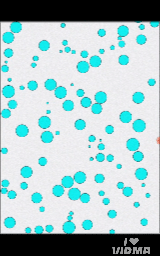

# ⚡ Ball Collision Detection

### A Lightweight Physics Simulation in JavaScript

[](https://developer.mozilla.org/en-US/docs/Web/JavaScript)
[](LICENSE)
[](https://github.com/Study1122/Ball_Collision_Detection)

---

## 🧠 Overview

**Ball Collision Detection** is an interactive 2D physics simulation that demonstrates how multiple particles collide and respond realistically inside a bounded canvas area.  
Built purely with **HTML5 Canvas** and **Vanilla JavaScript**, it showcases how vector math and elastic collision equations can produce smooth, visually engaging motion.

---

## 🔗 Useful Links

- 🌐 [Live Demo](https://study1122.github.io/Ball_Collision_Detection/)
- 📦 [Source Code](https://github.com/Study1122/Ball_Collision_Detection)
- 👨‍💻 [Author – Study1122](https://github.com/Study1122)
 

---

## ✨ Core Features

- 🎯 **Accurate collision detection** between multiple moving balls  
- 🔄 **Elastic collision response** based on physics equations  
- 🧮 **Vector-based math utilities** for precise velocity and angle control  
- ⚙️ **Modular architecture** (`Collision`, `Vector`and `animation modules`)  
- 🎨 **Smooth rendering** with real-time animation loop  
- 💻 **Zero dependencies** — works in any modern browser

---

## 📁 Project Structure

```bash
Ball_Collision_Detection/
│
├── index.html            # Main entry point
├── style.css             # Canvas styling and layout
├── main.js               # Core simulation and rendering logic
├── mathLib.js            # Vector operations and math utilities
└── collision_resolve.js  # Collision detection and response algorithms

```


## ⚙️ How It Works

1. Each ball is represented as an object with position, velocity, and radius.  
2. The **Collision** class calculates when two balls overlap.  
3. When a collision is detected, velocities are rotated into the collision axis, exchanged according to the **elastic collision equations**, and then rotated back to the global coordinate system.  
4. The system ensures smooth and realistic bouncing behavior.

---

## 🖥️ Demo

Clone this repository and open `index.html` in your browser:

```bash
git clone https://github.com/Study1122/Ball_Collision_Detection.git
cd Ball_Collision_Detection

```

## 🧩 Key Concepts Demonstrated

- 2D vector algebra and trigonometric rotation

- Conservation of momentum and kinetic energy

- Elastic vs. inelastic collision resolution

- Canvas animation loop and frame rendering

- Modular JavaScript architecture


---

## 💡 Future Enhancements

🌍 Add wall and boundary collision handling

🧲 Introduce gravity, friction, or user drag interactions

⚙️ Adjustable simulation parameters (speed, mass, ball count)

📊 Visualize velocity vectors or force lines

🎥 Export animation as GIF or video


---

## 🖼️ Preview

Add your own demo preview by including a preview.gif in the repository root.
Example command to create a GIF from a short screen recording:

<p align="center">
  
</p>

---

# 🤝 Contributing

Contributions are welcome!
Whether it's improving the physics accuracy, enhancing visuals, or optimizing performance — feel free to fork, modify, and submit a pull request.


---

## 📜 License

- Distributed under the `MIT License`.
- See 🪪 [License](LICENSE) for more details.

---

<div align="center">
  <sub>Developed with ❤️ by <a href="https://github.com/Study1122">Study1122</a></sub>
</div>
---
